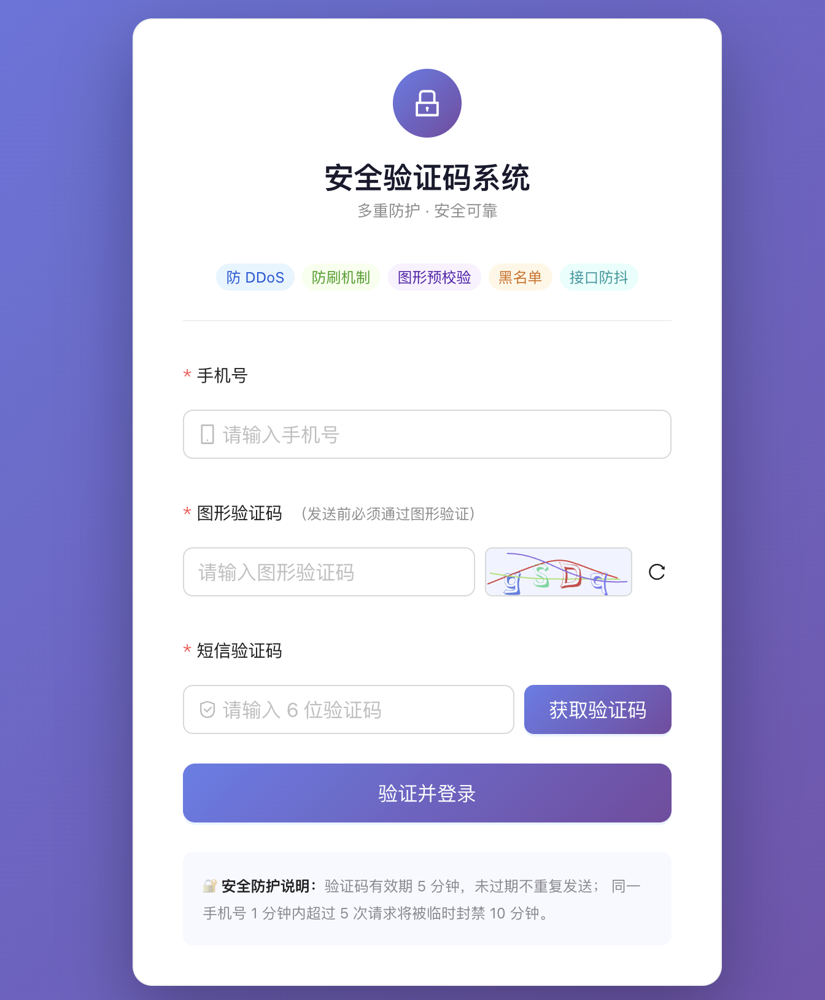

# 验证码安全验证系统

> 基于 React + Node.js 的多重防护验证码系统，涵盖前端防抖、图形验证码预校验与后端多层安全机制。



---

## 目录

- [项目概览](#项目概览)
- [技术栈](#技术栈)
- [项目结构](#项目结构)
- [快速启动](#快速启动)
- [功能说明](#功能说明)
- [验证流程](#验证流程)
- [安全防护机制](#安全防护机制)
- [接口文档](#接口文档)
- [配置说明](#配置说明)

---

## 项目概览

本项目实现了一套完整的短信验证码安全验证 Demo，重点演示在真实业务场景下如何防御以下威胁：

| 威胁类型 | 防御手段 |
|---------|---------|
| DDoS 攻击 | 全局限流（express-rate-limit） |
| 接口刷量 | 图形验证码预校验 + 前端倒计时防抖 |
| 爬虫/自动化脚本 | Referer + User-Agent 请求头校验 |
| 验证码滥用 | Redis 有效期管理 + 未过期不重复发送 |
| 高频恶意请求 | 黑名单机制（手机号 + IP 双维度） |

---

## 技术栈

### 前端

| 技术 | 版本 | 用途 |
|------|------|------|
| React | ^18 | UI 框架 |
| TypeScript | ^5 | 类型安全 |
| Ant Design | ^5 | UI 组件库 |
| ahooks | ^3 | `useRequest` / `useCountDown` |
| axios | ^1 | HTTP 请求封装 |
| Vite | ^4 | 构建工具 |

### 后端

| 技术 | 版本 | 用途 |
|------|------|------|
| Node.js | ≥16 | 运行时 |
| Express | ^4 | Web 框架 |
| ioredis | ^5 | Redis 客户端 |
| svg-captcha | ^1 | 图形验证码生成 |
| express-rate-limit | ^7 | 全局限流 |
| uuid | ^9 | 图形验证码 sessionId 生成 |
| nodemon | ^3 | 开发热更新 |

---

## 项目结构

```
captcha-demo/
├── README.md
├── server/                          # Node.js 后端服务
│   ├── package.json
│   ├── index.js                     # 主入口：Express 初始化、全局中间件、路由注册
│   ├── routes/
│   │   └── captcha.js               # 验证码相关路由（图形验证码 / 发送短信 / 校验）
│   ├── middleware/
│   │   └── security.js              # 安全中间件：Referer/UA 校验、黑名单检查、频率统计
│   └── utils/
│       ├── redis.js                 # Redis 操作封装（验证码存取、黑名单、频率计数）
│       └── captcha.js               # SVG 图形验证码生成
└── client/                          # React 前端应用
    ├── package.json
    ├── vite.config.ts
    └── src/
        ├── main.tsx                 # 应用入口
        ├── App.tsx                  # 根组件
        ├── index.css                # 全局基础样式
        ├── utils/
        │   └── request.ts           # axios 实例封装（baseURL、拦截器）
        └── components/
            ├── CaptchaForm.tsx      # 主表单：手机号 + 图形验证码 + 短信验证码
            └── ImageCaptcha.tsx     # 图形验证码子组件（展示 SVG + 刷新）
```

---

## 快速启动

### 前置条件

- Node.js ≥ 16
- 本地 Redis 服务已启动（默认 `127.0.0.1:6379`）

```bash
# 启动 Redis（macOS）
brew services start redis

# 或直接运行
redis-server
```

### 启动后端

```bash
cd captcha-demo/server
npm install
npm run dev        # 开发模式（nodemon 热更新）
# npm start        # 生产模式
```

后端服务运行在：`http://localhost:3001`

### 启动前端

```bash
cd captcha-demo/client
npm install
npm run dev
```

前端页面运行在：`http://localhost:5173`

---

## 功能说明

### 前端功能

#### 1. 图形验证码组件（`ImageCaptcha.tsx`）

- 页面加载时自动请求后端获取 SVG 图形验证码
- 点击验证码图片或刷新按钮可重新获取
- 每次获取到新验证码，将对应的 `sessionId` 通过回调传递给父组件
- 使用 `ahooks useRequest` 管理请求状态（loading / error）

#### 2. 主表单（`CaptchaForm.tsx`）

- **手机号输入**：前端正则格式校验（`/^1[3-9]\d{9}$/`）
- **图形验证码**：发送短信前必须填写，作为预校验凭证
- **获取验证码按钮**：
  - 点击后触发图形验证码 + 手机号的表单校验
  - 发送成功后启动 **60 秒倒计时**（`ahooks useCountDown`），期间按钮禁用
  - 若服务端返回"验证码已存在"，自动同步服务端剩余时间到前端倒计时
- **开发模式提示**：非 production 环境下，发送成功后页面会展示验证码（方便调试）
- **校验结果反馈**：提交后展示成功/失败的 Alert 提示

### 后端功能

#### 1. 图形验证码生成（`GET /api/captcha/image`）

- 使用 `svg-captcha` 生成 4 位 SVG 验证码（排除易混淆字符 `0oiIlL1`）
- 生成唯一 `sessionId`（UUID），将验证码答案存入 Redis（5 分钟有效）
- 返回 SVG 字符串和 `sessionId` 给前端

#### 2. 发送短信验证码（`POST /api/captcha/send-sms`）

- 依次执行：黑名单检查 → 图形验证码校验 → 防重复发送检查 → 生成并存储验证码
- 图形验证码**一次性消费**：校验通过后立即从 Redis 删除，防止重放攻击
- 验证码存入 Redis，有效期 **5 分钟**
- 若验证码未过期，拒绝重复发送并返回剩余秒数

#### 3. 校验短信验证码（`POST /api/captcha/verify-sms`）

- 从 Redis 读取存储的验证码进行比对
- 验证码过期或不存在时返回明确错误码

---

## 验证流程

```
用户操作                        前端                           后端
  │                              │                              │
  │── 打开页面 ─────────────────>│                              │
  │                              │── GET /api/captcha/image ──>│
  │                              │                              │── 生成 SVG + sessionId
  │                              │                              │── Redis 存储答案（5min）
  │                              │<── { svg, sessionId } ──────│
  │<── 展示图形验证码 ───────────│                              │
  │                              │                              │
  │── 输入手机号 + 图形验证码 ──>│                              │
  │── 点击"获取验证码" ─────────>│                              │
  │                              │── 前端表单校验（手机号格式）  │
  │                              │── POST /api/captcha/send-sms│
  │                              │   { phone,                  │
  │                              │     sessionId,              │
  │                              │     imageCaptchaText }      │
  │                              │                             │── ① 校验 Referer / UA
  │                              │                             │── ② 检查 IP/手机号黑名单
  │                              │                             │── ③ 统计请求频率
  │                              │                             │── ④ 校验图形验证码（消费）
  │                              │                             │── ⑤ 检查验证码是否已存在
  │                              │                             │── ⑥ 生成 6 位验证码
  │                              │                             │── ⑦ Redis 存储（5min）
  │                              │                             │── ⑧ 调用短信服务发送
  │                              │<── { success, devCode } ───│
  │<── 启动 60s 倒计时 ──────────│                              │
  │                              │                              │
  │── 输入短信验证码 ────────────>│                              │
  │── 点击"验证并登录" ──────────>│                              │
  │                              │── POST /api/captcha/verify-sms
  │                              │   { phone, code }           │
  │                              │                             │── Redis 读取验证码比对
  │                              │<── { success } ────────────│
  │<── 展示验证结果 ─────────────│                              │
```

---

## 安全防护机制

### 1. 全局限流（DDoS 防护）

```
位置：server/index.js
策略：每个 IP 在 15 分钟内最多请求 100 次
超限：返回 HTTP 429，提示"请求过于频繁"
```

### 2. Referer + User-Agent 校验（防爬虫）

```
位置：server/middleware/security.js
Referer 白名单：localhost:3000 / localhost:5173
拦截的 UA 特征：python-requests、curl、wget、scrapy、空 UA 等
超限：返回 HTTP 403，提示"请求来源不合法"
```

### 3. 图形验证码预校验

```
位置：server/routes/captcha.js
流程：前端携带 sessionId + 用户输入 → 服务端与 Redis 存储比对
特性：一次性消费（校验通过后立即删除），防止重放攻击
有效期：5 分钟
```

### 4. 验证码有效期管理（防滥用）

```
位置：server/utils/redis.js
有效期：5 分钟（Redis TTL）
防重复：验证码未过期时拒绝重复发送，返回剩余秒数
过期处理：Redis 自动删除，用户需重新获取
```

### 5. 黑名单机制（防刷）

```
位置：server/utils/redis.js + server/middleware/security.js
触发条件：同一手机号或 IP 在 1 分钟内请求超过 5 次
封禁时长：10 分钟
双维度：同时对 IP 和手机号进行独立统计和封禁
```

### 6. 前端防抖（接口防抖）

```
位置：client/src/components/CaptchaForm.tsx
方式：发送成功后启动 60 秒倒计时，期间"获取验证码"按钮禁用
同步：若服务端返回剩余时间，前端倒计时与服务端保持一致
```

---

## 接口文档

### GET `/api/captcha/image`

获取图形验证码

**响应示例**

```json
{
  "success": true,
  "data": {
    "sessionId": "550e8400-e29b-41d4-a716-446655440000",
    "svg": "<svg>...</svg>"
  }
}
```

---

### POST `/api/captcha/send-sms`

发送短信验证码

**请求体**

```json
{
  "phone": "13800138000",
  "imageCaptchaSessionId": "550e8400-e29b-41d4-a716-446655440000",
  "imageCaptchaText": "a3k9"
}
```

**响应示例（成功）**

```json
{
  "success": true,
  "message": "验证码已发送，请注意查收",
  "devCode": "123456"
}
```

**响应示例（验证码未过期）**

```json
{
  "success": false,
  "code": "CODE_ALREADY_SENT",
  "message": "验证码已发送，请 180 秒后再试",
  "data": { "remainingSeconds": 180 }
}
```

**错误码说明**

| 错误码 | HTTP 状态 | 说明 |
|--------|----------|------|
| `INVALID_PHONE` | 400 | 手机号格式错误 |
| `MISSING_IMAGE_CAPTCHA` | 400 | 缺少图形验证码参数 |
| `INVALID_IMAGE_CAPTCHA` | 400 | 图形验证码错误或已过期 |
| `CODE_ALREADY_SENT` | 429 | 验证码未过期，不重复发送 |
| `BLACKLISTED` | 429 | 手机号或 IP 在黑名单中 |
| `TOO_MANY_REQUESTS` | 429 | 请求频率超限，已加入黑名单 |
| `INVALID_UA` | 403 | User-Agent 不合法 |
| `INVALID_REFERER` | 403 | Referer 不合法 |

---

### POST `/api/captcha/verify-sms`

校验短信验证码

**请求体**

```json
{
  "phone": "13800138000",
  "code": "123456"
}
```

**响应示例（成功）**

```json
{
  "success": true,
  "message": "验证码校验通过"
}
```

**响应示例（失败）**

```json
{
  "success": false,
  "code": "INVALID_CODE",
  "message": "验证码错误，请重新输入"
}
```

---

## 配置说明

### 后端环境变量

| 变量名 | 默认值 | 说明 |
|--------|--------|------|
| `PORT` | `3001` | 服务监听端口 |
| `REDIS_HOST` | `127.0.0.1` | Redis 主机地址 |
| `REDIS_PORT` | `6379` | Redis 端口 |
| `REDIS_PASSWORD` | 无 | Redis 密码（可选） |
| `NODE_ENV` | `development` | 环境标识（production 时不返回 devCode） |

### 关键参数（`server/utils/redis.js`）

| 参数 | 默认值 | 说明 |
|------|--------|------|
| `SMS_CODE_TTL` | `300`（5 分钟） | 短信验证码有效期（秒） |
| `IMAGE_CAPTCHA_TTL` | `300`（5 分钟） | 图形验证码有效期（秒） |
| `BLACKLIST_TTL` | `600`（10 分钟） | 黑名单封禁时长（秒） |
| `REQUEST_COUNT_TTL` | `60`（1 分钟） | 频率统计时间窗口（秒） |
| `MAX_REQUESTS_PER_MINUTE` | `5` | 时间窗口内最大请求次数 |
